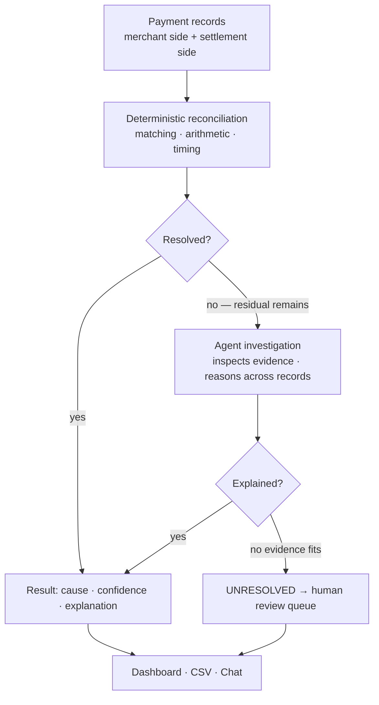
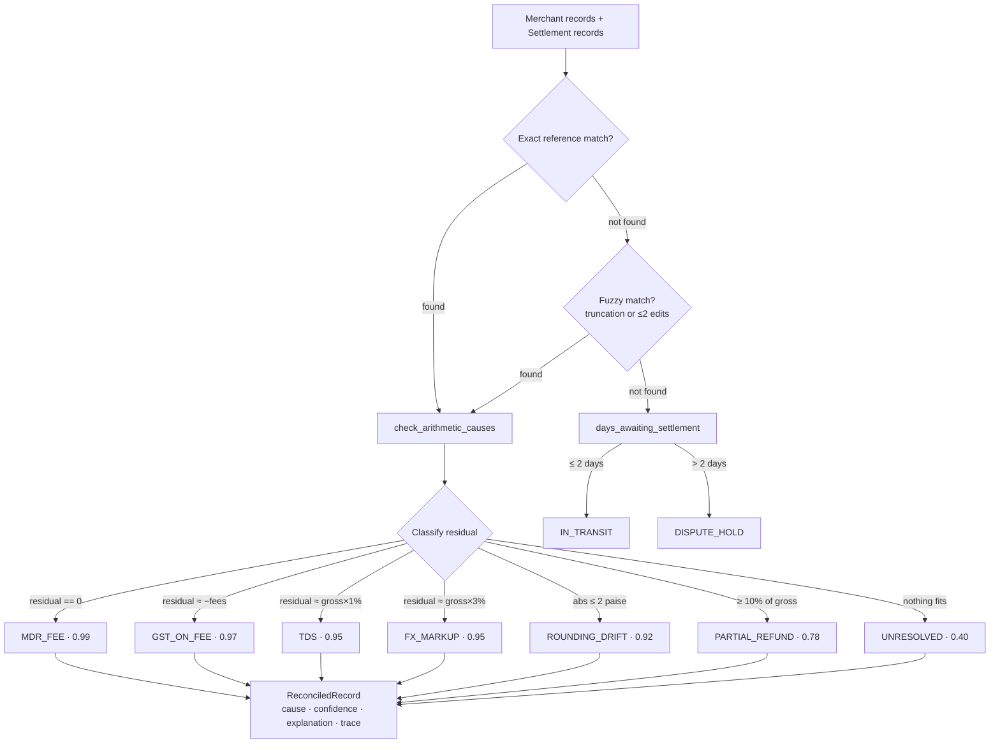
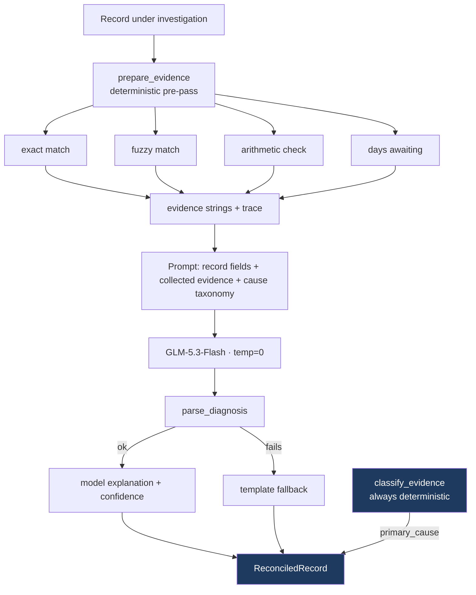
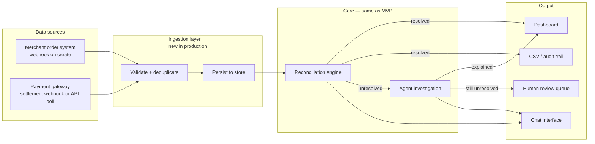
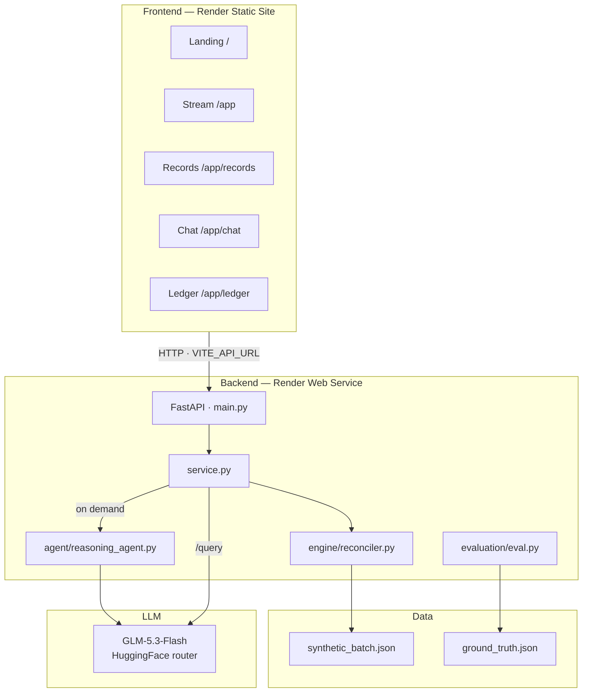

# Residual — Settlement Reconciliation Agent

**Live demo:** [residual-thefin-ops-agent-ljb9.onrender.com](https://residual-thefin-ops-agent-ljb9.onrender.com)

```bash
# Run locally
uvicorn backend.main:app --port 8001
npm run dev --prefix frontend
```

---

## Why this problem

Payment reconciliation looks simple until the records don't agree.

One side says a payment should have settled for a certain amount. The other says something slightly different. Sometimes a fee explains the gap. Sometimes a reference was altered in transit. Sometimes the settlement arrived later than expected. Sometimes several pieces of evidence need to be read together. And sometimes there genuinely isn't enough information to know.

Most reconciliation systems are very good at the cases that can be expressed as rules. The interesting problem starts after those rules have done their job — when a record doesn't fit any known pattern and someone has to figure out why.

**Residual is an MVP exploring that problem: what does an intelligent investigation layer look like for the cases that deterministic reconciliation cannot cleanly resolve?**

The design is deliberately simple. Code establishes what can be proven — matching, arithmetic, timing, known deduction patterns. Only then does the agent step in to investigate the remaining ambiguity and produce an explanation grounded in that evidence. The system isn't trying to make a language model the financial authority. It's exploring what happens when deterministic financial logic and agentic investigation are given clearly separated jobs.

---

## The core architecture



Everything else in the system supports this flow. The core pipeline does not depend on a language model — the model is an additional reasoning layer, not a dependency for correctness.

---

## What we built

The MVP reconciles a batch of 55 synthetic records across three business types and eight discrepancy causes. It demonstrates the full workflow end to end:

- A deterministic reconciliation engine that handles matching, arithmetic, and classification
- An LLM agent that runs on demand for per-record investigation and explanation
- A conversational interface ("Reya") for querying the batch in plain English
- Four views: reconciliation stream, records table, side-by-side dual ledger, chat
- CSV export and accuracy metrics scored against held-back ground truth labels

Residual's core reconciliation pipeline does not depend on an LLM. The model is an additional reasoning interface — remove it and the financial classification still works correctly.

---

## Why synthetic data

The MVP doesn't connect to a live financial system. Rather than hard-code a handful of examples, we generated a controlled dataset with known causes and kept the answer labels entirely separate from the reconciliation and agent layers.

That gave us something more useful than realistic-looking data alone: a repeatable experiment. We can deliberately introduce specific discrepancy types, run the full pipeline, compare the result against the hidden ground truth, inspect any failures, change the system, and run it again. The dataset isn't there to claim production accuracy — it's there to make the engineering loop measurable.

---

## The interface

**Reconciliation stream** — the five pipeline steps run in sequence (load, match, recover, classify), then surface findings as chat messages with links to the evidence for each flagged record.


---

**Dual ledger** — merchant records on the left, settlement records on the right. Hover either row to highlight its pair. Unmatched rows have a red marker. Click any row to open the full explanation, breakdown, and reasoning trace.


---

**Ask the agent (Reya)** — ask questions about the current reconciliation batch in plain English. The agent uses the reconciliation results and available evidence to explain which records need attention and why.


---

## The first version failed — here's what we changed

The first version was more agentic in the wrong sense. The model chose which tools to call, performed its own arithmetic, found the match, and decided the cause.

```
First version — full model autonomy
Pairing accuracy       45.5%
Diagnosis accuracy     36.4%
```

Instead of tuning the prompt, we stepped back and asked a simpler question: **which parts of this problem actually require a model?**

Matching records doesn't. Computing fees doesn't. Checking settlement age doesn't. These are deterministic operations — code does them correctly every time.

So we moved those responsibilities into the engine and left the model with the part that genuinely benefits from reasoning: explaining the evidence and handling the ambiguous cases where no clean rule applies.

Two bugs also surfaced during this process. The model provider was rejecting a message role that the agent framework was inserting. The auto-generated tool schema contained a field that strict validators rejected silently. Neither raised an exception — the model just received malformed input and returned garbage. Fixing both required reading the actual API response format rather than assuming compatibility.

After the architectural change:

```
Revised version — deterministic evidence, model for explanation only
Pairing accuracy       100%
Diagnosis accuracy     100%
```

The system improved because we gave the model less to do, not more.

These numbers are measured against a synthetic evaluation batch with self-generated ground truth. That's an MVP measurement, not a production claim — an independent holdout set is the obvious next step.

---

## How the reconciliation pipeline works



No model is consulted in this pass. Template-based explanation prose is generated per cause by `reporting/narrative.py`. The LLM is a separate, optional layer.

---

## How the agent layer works



`primary_cause` is always set by `classify_evidence()` — deterministic code, same logic as the batch engine. The model writes the explanation; it never sets the cause. A failed or malformed model response degrades explanation quality but cannot change the classification.

---

## What production would actually require

The MVP uses two synthetic data files so the pipeline can be evaluated without access to live financial systems. In a production version, those files would be replaced by authenticated ingestion interfaces, with validation, persistence, and asynchronous processing around the same core reconciliation and investigation flow.



The architecture scales at the ingestion and persistence boundaries — not in the reconciliation or agent logic, which stays the same.

---

## Full system architecture (MVP)



---

## Current limitations

- The evaluation batch is synthetic and self-generated. The 100% figures are an MVP measurement, not a production claim. An independently constructed holdout set is the next honest step.
- Fuzzy matching uses structural heuristics. At large scale with many same-day references, settlement amount would need to serve as a second matching signal.
- Partial refund detection is a heuristic (≥10% of gross, no other known cause). A real deployment needs the merchant's refund records as a third source to confirm.
- The chat agent re-runs the full batch on every query. In production this would be cached.
- 2 records in this batch are genuinely unresolved — no cause fits the evidence. In production those route to a human review queue automatically.

---

## Where this could go

The current MVP deliberately stops before the hardest production problems: live ingestion, larger volumes, independent evaluation data, richer evidence sources, persistence, and human review workflows.

Those aren't problems we wanted to hide behind a polished demo. They are the next engineering problems.

The core idea stays the same regardless of scale: **prove what can be proven deterministically, investigate what can't, and keep the boundary between the two explicit.**

---

## Running locally

**Prerequisites:** Python 3.11+, Node 18+, a HuggingFace token.

```bash
git clone https://github.com/RakshithDasari/Residual_theFIN_OPS-agent.git
cd Residual_theFIN_OPS-agent

# Backend
cp .env.example .env
# set HF_TOKEN in .env

python -m venv .venv
.venv\Scripts\activate          # Windows
# source .venv/bin/activate     # Mac/Linux

pip install -r requirements.txt
uvicorn backend.main:app --port 8001

# Frontend (separate terminal)
cd frontend
npm install
echo "VITE_API_URL=http://localhost:8001" > .env.local
npm run dev
```

Open `http://localhost:5173`. Health check: `http://localhost:8001/health`.

```bash
python -m engine.reconciler   # deterministic engine standalone
python -m evaluation.eval     # score against ground truth
```

---

## Live deployment

| | URL |
|---|---|
| Frontend | https://residual-thefin-ops-agent-ljb9.onrender.com |
| Backend health | https://residual-thefin-ops-agent.onrender.com/health |
| Batch API | https://residual-thefin-ops-agent.onrender.com/batch |

---

## Project structure

```
├── backend/         FastAPI routes + service layer
├── engine/          Deterministic matcher, reconciler, settlement client
├── agent/           LLM agent, tools, 10-cause taxonomy
├── data/            Schemas, synthetic batch, ground truth
├── reporting/       Narrative templates, report builder, CSV export
├── evaluation/      Accuracy scoring against held-back labels
├── frontend/src/    React pages, api.js, animated components
├── config.py        Model singleton, paths, env vars
├── context.py       ContextVar for per-record tool isolation
├── requirements.txt Pinned deps
└── render.yaml      Render deploy config
```

---

## Stack

| | |
|---|---|
| Backend | Python 3.11, FastAPI, uvicorn |
| Agent framework | Agno 2.9.0 |
| LLM | GLM-5.3-Flash via HuggingFace OpenAI-compatible router |
| Fuzzy matching | rapidfuzz (Levenshtein) |
| Frontend | React 19, Vite 8, React Router 7 |
| Animations | motion/react |
| Deployment | Render (web service + static site) |
