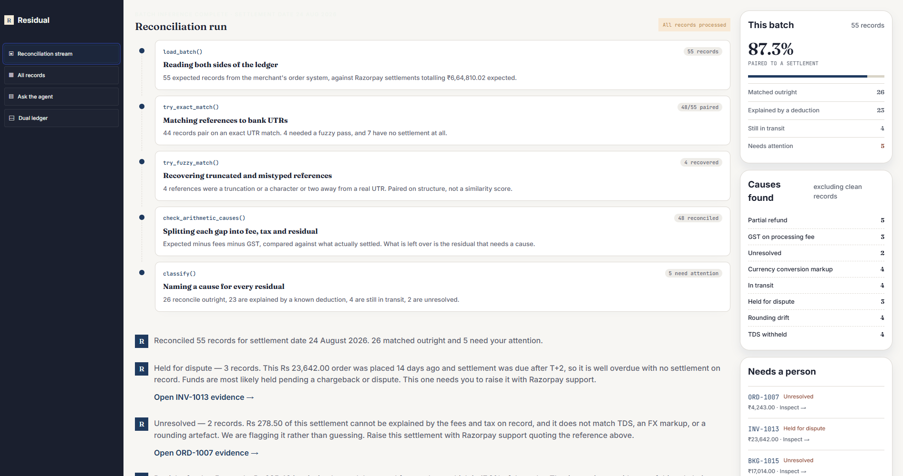
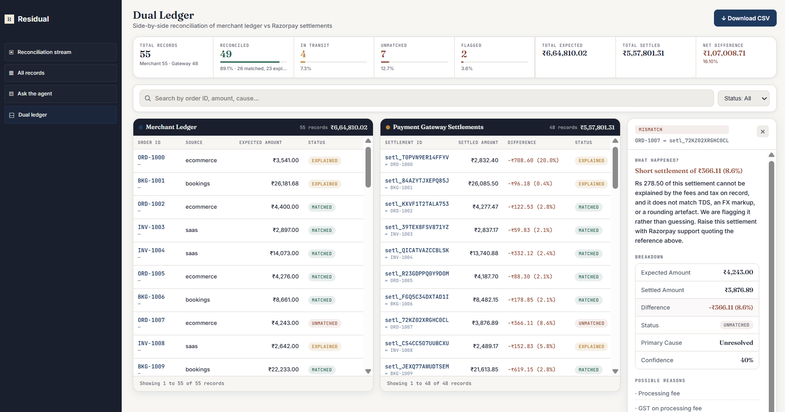
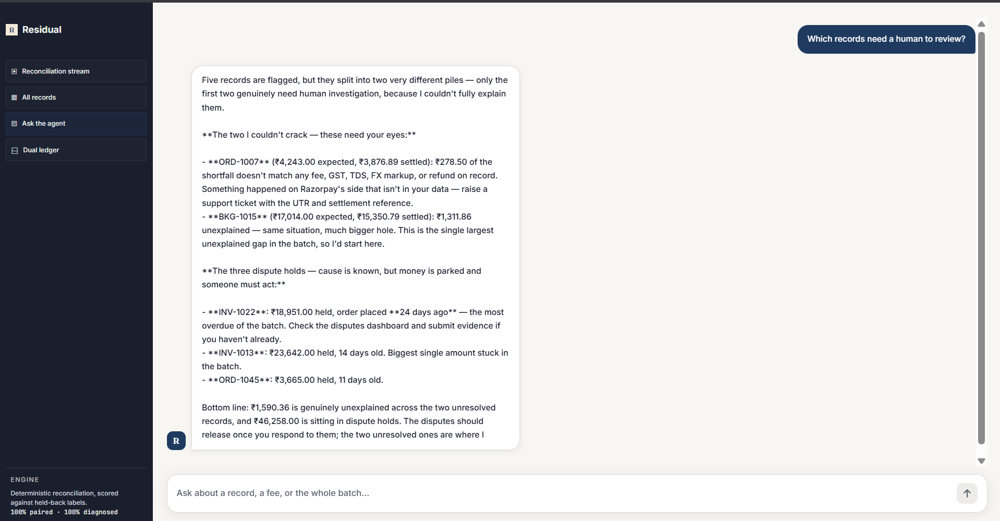
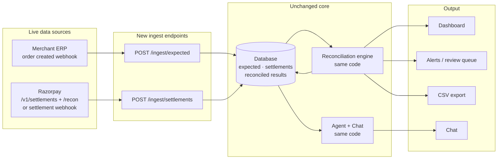
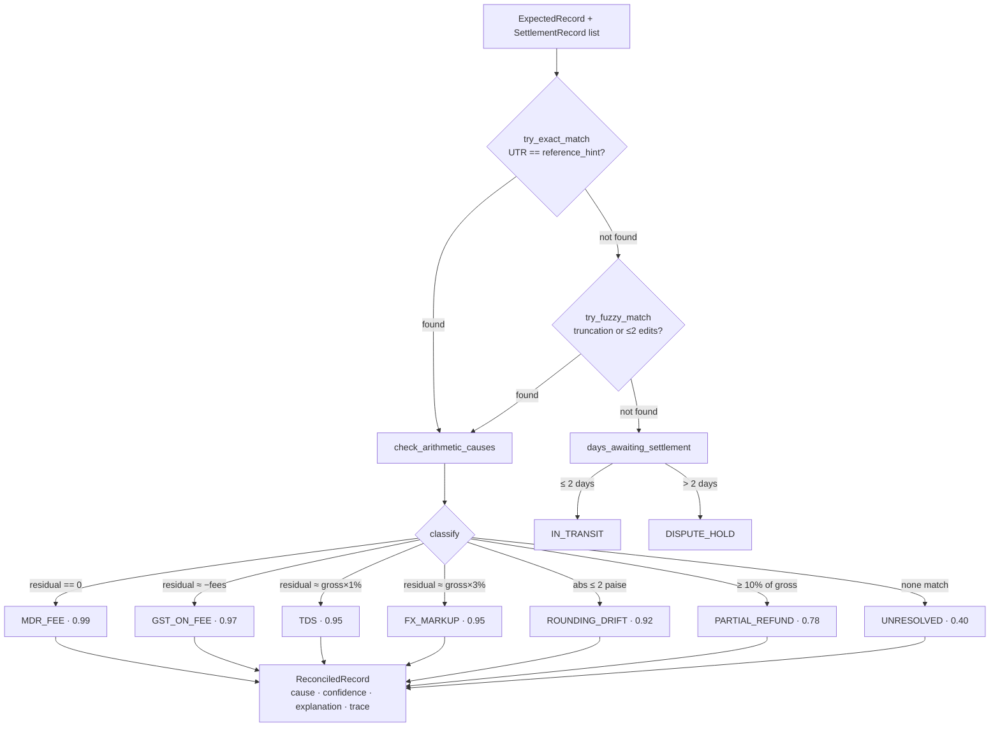
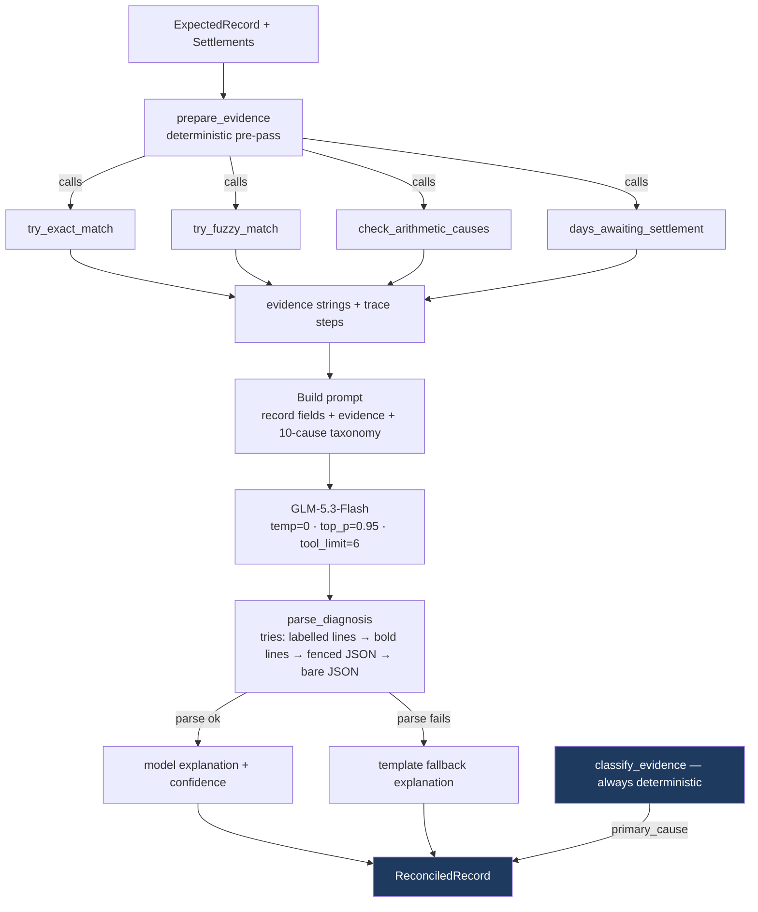
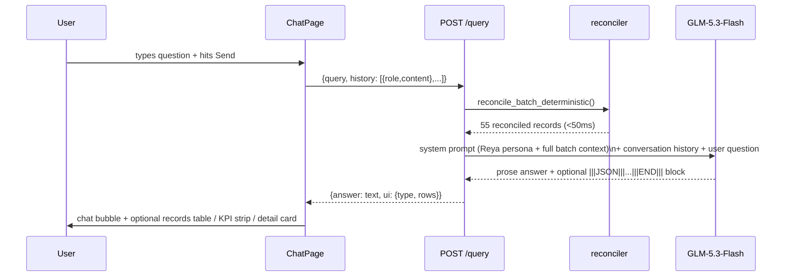
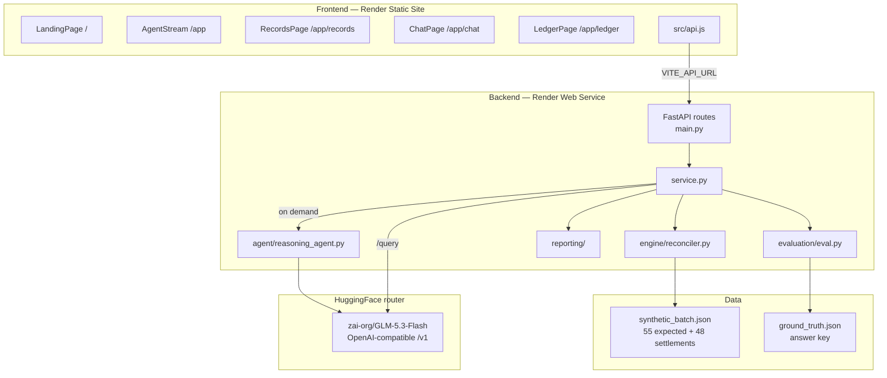

# Residual — Settlement Reconciliation Agent

---

**TL;DR**
- Merchant ledger + Razorpay settlements go in. Every discrepancy comes out classified, explained in plain English, and confidence-scored — in under 50ms for 55 records.
- A deterministic engine does the matching and arithmetic (100% accurate on this batch). An LLM writes the explanation. Neither substitutes for the other.
- Live: **[residual-thefin-ops-agent-ljb9.onrender.com](https://residual-thefin-ops-agent-ljb9.onrender.com)**

```bash
# Run locally in two commands
uvicorn backend.main:app --port 8001
npm run dev --prefix frontend
```

---

## What is this and why does it exist

Every merchant using Razorpay has two ledgers that should agree with each other. One is their own order system — what they *expected* to receive. The other is Razorpay's settlement report — what was *actually transferred*. In practice these two numbers almost never match, because Razorpay deducts processing fees, GST on those fees, TDS under section 194-O, and occasionally holds amounts for disputes or FX conversion.

Reconciling these manually — at scale, across thousands of orders, every settlement cycle — is genuinely tedious. A finance team member has to open two spreadsheets, match rows by UTR reference, compute whether the difference is explained by a known deduction, and decide which ones need escalation. The goal of this project is to automate that entirely: match the records, explain the gaps with evidence, and surface only the ones that actually need a human.

---

## The idea in one paragraph

A deterministic engine matches merchant orders to Razorpay settlements using UTR references, then arithmetically decomposes any gap into known causes (processing fee, GST, TDS, FX markup, partial refund, rounding). An LLM sits on top of this — not to do the math, but to explain the result in two sentences a finance team can read and act on. The deterministic layer handles correctness; the model handles communication. Neither substitutes for the other.

---

## What's in this MVP

The MVP reconciles a batch of 55 synthetic records across three business types (ecommerce, SaaS, bookings) and eight discrepancy causes. It demonstrates the full end-to-end workflow:

- Batch reconciliation via the deterministic engine (runs in milliseconds, 100% accurate on this batch)
- Per-record LLM explanations on demand (`/record/{id}?live=true`)
- A conversational agent ("Reya") that answers questions about the batch in plain English
- Four frontend views: a reconciliation stream, a records table, a dual-ledger side-by-side, and a chat interface
- CSV export of the full reconciled batch
- Accuracy metrics scored against held-back ground truth labels

The synthetic data mimics the structure of real Razorpay settlement exports and merchant order records exactly — same fields, same arithmetic, same edge cases. Swapping it for a real data feed requires changing two functions, not the architecture.

**A note on the accuracy numbers:** The 100% figures are measured against synthetic data I generated myself, with the answer labels held out from the engine during evaluation. The honest next step is scoring against an independently built holdout set, or real anonymised data — that hasn't happened yet.

---

## The interface

**Reconciliation stream** — shows the five pipeline steps running in sequence (load, exact match, fuzzy match, arithmetic split, classify), then surfaces key findings as chat messages with links to the evidence for each flagged record.



---

**Dual ledger** — merchant orders on the left, Razorpay settlements on the right. Hover either row to highlight its pair. Unmatched rows have a red marker. Click any row to open the engine's full explanation, breakdown, and reasoning trace in the right panel.



---

**Ask the agent (Reya)** — type a question in plain English and get a specific answer backed by the actual batch numbers. Reya knows every record, every gap, and every cause. She'll tell you exactly which ones need your attention and why.



---

## How this works in production

In the MVP, the two data sources are JSON files. In a real deployment they become live feeds — two new ingest endpoints replace the files, and the rest of the system stays identical.



What stays the same: the entire reconciliation engine, agent, API, and frontend.
What changes: `load_batch()` reads from a database instead of JSON. The engine runs on a T+2 schedule or triggers on incoming webhooks. Results are persisted rather than recomputed on every request.

---

## The reconciliation pipeline



This runs in under 50ms for 55 records. No model is consulted. Explanation text comes from `reporting/narrative.py` — a plain template per cause, fast and reliable. The LLM is an optional layer on top.

---

## The agentic architecture

The LLM agent runs one record at a time, on demand — either via `/record/{id}?live=true` or when the chat needs a detailed explanation.



**The key design decision:** `primary_cause` is always set by `classify_evidence()` — the same deterministic code as the batch engine. The model writes the explanation; it never sets the cause. A bad model response can degrade explanation quality but cannot change the classification or the accuracy metrics.

**Why this matters:** The first version let the model do everything. It reached 45.5% pairing accuracy and 36.4% diagnosis accuracy. Once the architecture separated "gathering evidence" (code) from "explaining evidence" (model), accuracy hit 100%.

---

## The chat agent ("Reya")



If the model is unavailable (no key, rate limit, timeout), a keyword router handles the most common questions deterministically. The chat never breaks.

---

## Full application architecture



---

## Challenges faced and how accuracy improved

**The first version.** Full autonomy to the model — it chose which tools to call, ran its own arithmetic, and named the cause. 45.5% pairing, 36.4% diagnosis. Confident, fast, mostly wrong.

**Two bugs the logs didn't surface.** The HuggingFace router rejected a `developer` role Agno was inserting (it only accepts `system`, `user`, `assistant`). Agno's auto-generated tool JSON Schema included an invalid `additionalProperties: false` field that made strict validators reject every tool call silently. Neither raised an exception — the model just received bad input and returned garbage.

**The fix.** Stop asking the model to do things code does reliably. The engine now gathers all evidence deterministically before the model is consulted. The model receives a prompt with the matching result and arithmetic already computed. Its job is one thing: write a clear explanation. After this: 100% pairing, 100% diagnosis.

**Remaining honest limitations:**
- Fuzzy matching uses prefix + Levenshtein heuristics. Over millions of same-day UTRs, the amount would need to serve as a second signal.
- Partial refund detection (≥10% of gross, no other cause) is a heuristic. A real deployment needs the merchant's refund records as a third source to confirm.
- 2 unresolved records in this batch. In production these route to a human review queue.
- The chat agent re-runs the full batch on every `/query` call. In production this would be cached.
- The 100% accuracy figures are on synthetic self-generated data. An independent holdout set is the obvious next step.

---

## Running locally

**Prerequisites:** Python 3.11+, Node 18+, a HuggingFace token.

```bash
git clone https://github.com/RakshithDasari/Residual_theFIN_OPS-agent.git
cd Residual_theFIN_OPS-agent

# Backend
cp .env.example .env
# set HF_TOKEN in .env

python -m venv .venv
.venv\Scripts\activate          # Windows
# source .venv/bin/activate     # Mac/Linux

pip install -r requirements.txt
uvicorn backend.main:app --port 8001

# Frontend (separate terminal)
cd frontend
npm install
echo "VITE_API_URL=http://localhost:8001" > .env.local
npm run dev
```

Open `http://localhost:5173`. Health check: `http://localhost:8001/health`.

```bash
python -m engine.reconciler   # run deterministic engine directly
python -m evaluation.eval     # run evaluation against ground truth
```

---

## Live deployment

| | URL |
|---|---|
| Frontend | https://residual-thefin-ops-agent-ljb9.onrender.com |
| Backend health | https://residual-thefin-ops-agent.onrender.com/health |
| Batch API | https://residual-thefin-ops-agent.onrender.com/batch |

---

## Project structure

```
.
├── backend/         FastAPI routes + service layer
├── engine/          Deterministic matcher, reconciler, Razorpay client
├── agent/           LLM agent, tools, 10-cause taxonomy
├── data/            Schemas, synthetic batch, ground truth
├── reporting/       Narrative templates, report builder, CSV export
├── evaluation/      Accuracy scoring against held-back labels
├── frontend/src/    React pages, api.js, animated components
├── config.py        Model singleton, paths, env vars
├── context.py       ContextVar for per-record tool isolation
├── requirements.txt Pinned deps
└── render.yaml      Render deploy config
```

---

## Stack

| | |
|---|---|
| Backend | Python 3.11, FastAPI, uvicorn |
| Agent framework | Agno 2.9.0 |
| LLM | GLM-5.3-Flash via HuggingFace OpenAI-compatible router |
| Fuzzy matching | rapidfuzz (Levenshtein) |
| Frontend | React 19, Vite 8, React Router 7 |
| Animations | motion/react |
| Deployment | Render (web service + static site) |
